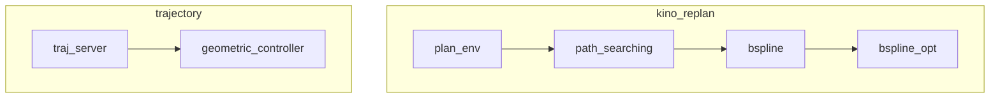
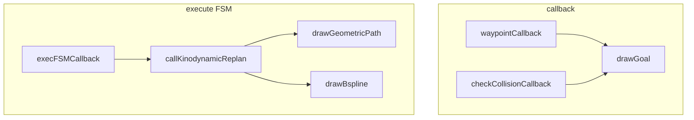
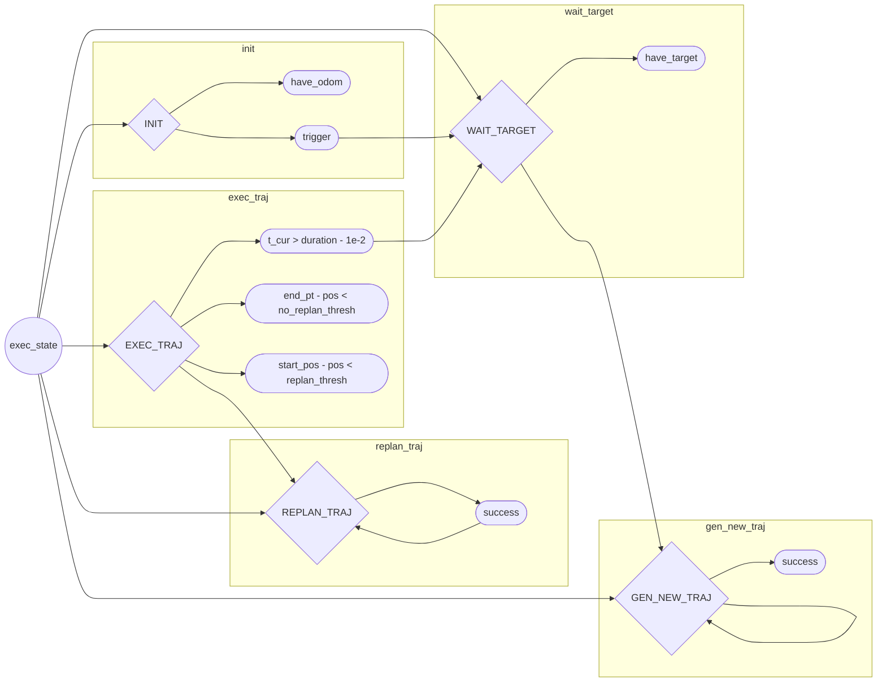

```mermaid
flowchart TB
  subgraph kino_replan
    plan_env --> path_searching;
    path_searching --> bspline;
    bspline --> bspline_opt;
  end
  subgraph trajectory
    traj_server --> geometric_controller;
  end
```

```mermaid
flowchart TB
  subgraph callback
    waypointCallback --> drawGoal;
    checkCollisionCallback --> drawGoal;
  end
  subgraph execute FSM
    execFSMCallback --> callKinodynamicReplan;
    callKinodynamicReplan --> drawGeometricPath;
    callKinodynamicReplan --> drawBspline;
  end
```

```mermaid
flowchart LR
    id1((exec_state)) --> id2{INIT}
    id1 --> id3{WAIT_TARGET}
    id1 --> id4{GEN_NEW_TRAJ}
    id1 --> id5{EXEC_TRAJ}
    id1 --> id6{REPLAN_TRAJ}
    subgraph replan_traj
        id6 --> id14([success])
    end
    subgraph exec_traj
        id5 --> id11([t_cur > duration - 1e-2])
        id5 --> id12([end_pt - pos < no_replan_thresh])
        id5 --> id13([start_pos - pos < replan_thresh])
    end
    subgraph gen_new_traj
        id4 --> id10([success])
    end
    subgraph wait_target
        id3 --> id9([have_target])
    end
    subgraph init
        id2 --> id7([have_odom])
        id2 --> id8([trigger])
    end
    id8 --> id3
    id3 --> id4
    id4 --> id4
    id5 --> id6
    id11 --> id3
    id14 --> id6
```
