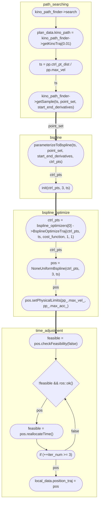

```mermaid
flowchart TD
    subgraph path_searching
    id1(["kino_path_finder->search"]) --> id2(["plan_data.kino_path = kino_path_finder->getKinoTraj(0.01)"])
    id2 --> id3(["ts = pp.ctrl_pt_dist / pp.max_vel"])
    id3 --> |ts| id4(["kino_path_finder->getSample(ts, point_set, start_end_derivatives)"])
    end
    subgraph bspline
    id4 ==> |point_set| id5(["parameterizeToBspline(ts, point_set, start_end_derivatives, ctrl_pts)"])
    id5 --> |ctrl_pts| id6(["init(ctrl_pts, 3, ts)"])
    end 
    subgraph bspline_optimize
    id6 ==> id7(["ctrl_pts = bspline_optimizers[0] - >BsplineOptimizeTraj(ctrl_pts, ts, cost_function, 1, 1)"])
    id7 --> |ctrl_pts| id8(["pos = NoneUniformBspline(ctrl_pts, 3, ts)"])
    id8 --> |pos| id9(["pos.setPhysicalLimits(pp_.max_vel_, pp_.max_acc_)"])
    end
    subgraph time_adjustment
    id9 ==> id10(["feasible = pos.checkFeasibility(false)"])
    id10 --> id11{"!feasible && ros::ok()"}
    id11 --> |pos| id12(["feasible = pos.reallocateTime()"])
    id12 --> id13(["if (++iter_num >= 3) "])
    id13 --> |false| id11
    id13 --> |pos| id14(["local_data.position_traj = pos"])
    end
```
