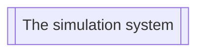
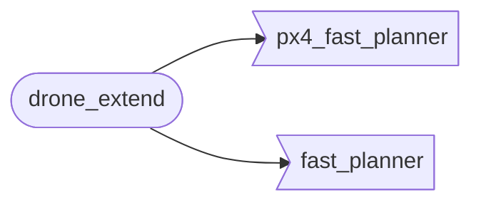
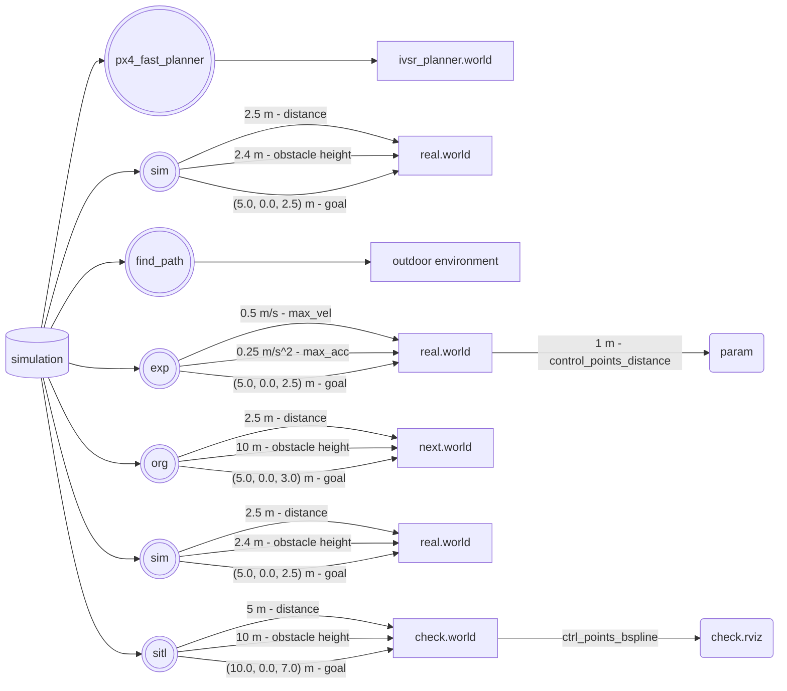

```mermaid
flowchart TD
    id1[[The simulation system]]
```    

```mermaid
flowchart LR
  id1([drone_extend]) --> id2>px4_fast_planner]
  id1 --> id3>fast_planner]
```

```mermaid
flowchart LR 

id1[(simulation)] --> id2(((px4_fast_planner)))
id2 --> id3[ivsr_planner.world]
id1 --> id4(((sim)))
id4 -->|2.5 m - distance| id5[real.world]
id4 -->|2.4 m - obstacle height| id5
id4 -->|"(5.0, 0.0, 2.5) m - goal"| id5
id1 --> id6(((find_path)))
id6 --> id7[outdoor environment]
id1 --> id8(((exp)))
id8 -->|0.5 m/s - max_vel| id9[real.world]
id8 -->|0.25 m/s^2 - max_acc| id9
id8 -->|"(5.0, 0.0, 2.5) m - goal"| id9
id9 -->|1 m - control_points_distance| id10(param)
id1 --> id11(((org)))
id11 -->|2.5 m - distance| id12[next.world]
id11 -->|10 m - obstacle height| id12
id11 -->|"(5.0, 0.0, 3.0) m - goal"| id12
id1 --> id13(((sim)))
id13 -->|2.5 m - distance| id14[real.world]
id13 -->|2.4 m - obstacle height| id14
id13 -->|"(5.0, 0.0, 2.5) m - goal"| id14
id1 --> id15(((sitl)))
id15 -->|5 m - distance| id16[check.world]
id15 -->|10 m - obstacle height| id16
id15 -->|"(10.0, 0.0, 7.0) m - goal"| id16
id16 -->|ctrl_points_bspline| id17(check.rviz)
```
